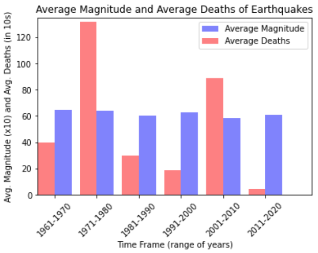

# Earthquake Data Sorting
This program uses the Python libraries cs103 (course library), typing, csv, and matplotlib to analyse data on every global earthquake in the last 60 years from a csv file to calculate and plot the average magnitude and average deaths caused for different periods in order to determine whether or not there is a relationship between earthquake magnitude and deaths. 

When run, the program produces six different graphs; the first five are tests, and the sixth graph is the final result using the full dataset of 2403 earthquakes: 



## To install dependencies:
```shell 
$ pip install -r requirements.txt
```

## To run:
```shell 
$ python main.py
```
